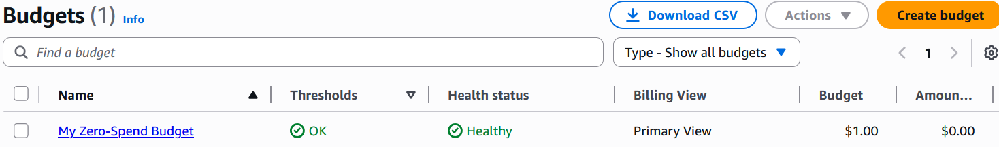
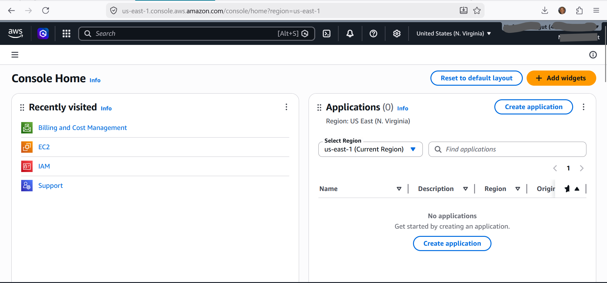
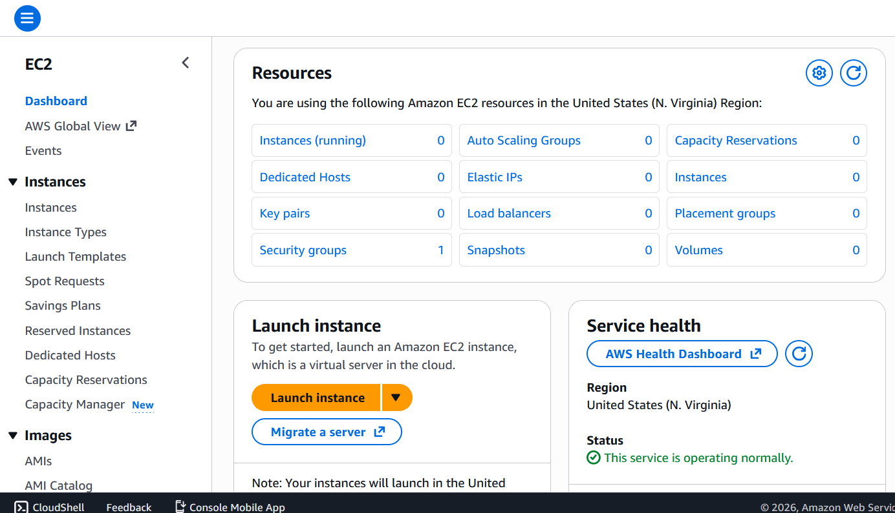
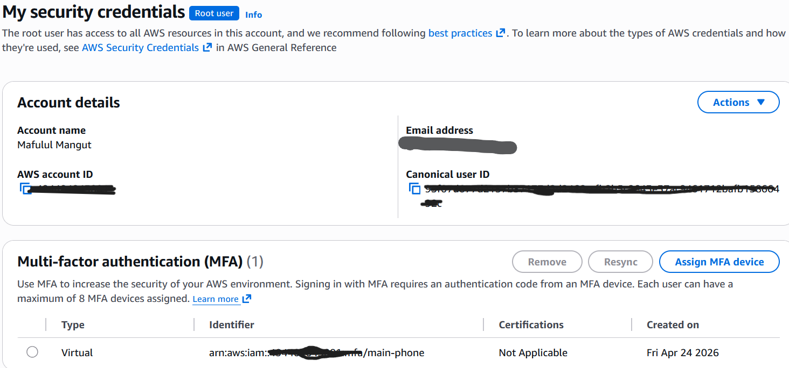

# Lab Name: Sign Up for AWS Free Tier & Explore the Console

## Overview
These AWS foundational labs focused on establishing a secure and operational cloud environment by creating an AWS account, enabling Multi-Factor Authentication (MFA) to protect the root account, exploring the AWS Management Console and core services (EC2, S3, RDS, IAM, Lambda), and configuring billing alerts for cost monitoring and budget control.

## Learning Objectives
- Create an AWS account (Free Tier)
- Enable MFA on the root account
- Navigate the AWS Management Console to identify 5 core services (EC2, S3, RDS, IAM, Lambda).

## AWS Services Used
- AWS Console
- AWS IAM (Identity and Access Management)

## Prerequisites
- Valid email address
- Credit/debit card (Free Tier is free — card only required for verification)
- AWS account (free tier)
- Phone for MFA setup (Google Authenticator or Authy)

## Step-by-Step Instructions

### Step 1 Create Your AWS Account
1. Go to https://aws.amazon.com and click Create an AWS Account.
2. Enter your email address and choose a root account name (e.g. 'YourName AWS Learning').
3. Enter your contact information — select Personal account type.
4. Enter billing information (card will NOT be charged for Free Tier usage).
5. Verify your phone number via SMS or voice call.
6. Select the Free support plan and complete sign-up.
7. Sign in to the AWS Management Console at https://console.aws.amazon.com.

### Step 2: Secure the Root Account with MFA
1. In the console top-right, click your account name → Security credentials.
2. Under Multi-factor authentication (MFA), click Assign MFA device.
3. Choose Authenticator app. Install Google Authenticator or Authy on your phone.
4. Scan the QR code shown on screen.
5. Enter two consecutive 6-digit codes from the app to verify.
6. Click Add MFA. You should see your device listed as Assigned.

### Step 3 Explore the Console
1. Use the search bar at the top to find these services one by one: EC2, S3, IAM, RDS, Lambda.
2. Click on EC2 — note the dashboard. You are in a specific Region (shown top-right).
3. Change the Region to US East (N. Virginia) using the Region selector.
4. Navigate to Services → All Services. Scroll through the full list.
5. Click the AWS icon (top-left) to return to the main console home.

### Step 4 Set Your Billing Alert
1. Search for Billing and Cost Management in the console.
2. Click Budgets → Create budget → Use a template → Zero spend budget.
3. Enter your email address for alerts. Click Create budget.
4. This ensures you get an email if you accidentally incur charges.

## Screenshots

## Key Concepts Learned
- The root account should NEVER be used for day-to-day operations
- IAM policies follow the principle of least privilege
- MFA adds a critical second layer of security

## Challenges Faced & Solutions
| Challenge | Solution |
|-----------|----------|
| N/A | N/A |

## Cleanup
To avoid charges, resources will always be deleted after lab sessions.
However, this does not apply to this lab.

---
*Completed: April 2026 | BaseStack AWS Cloud Accelerator — Cohort 1*
