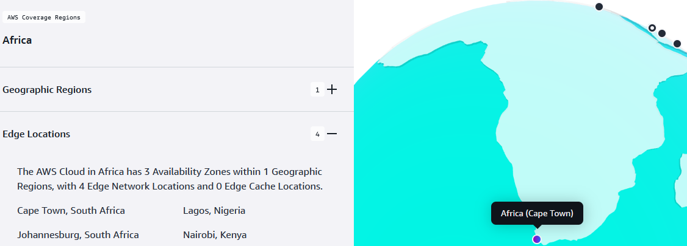
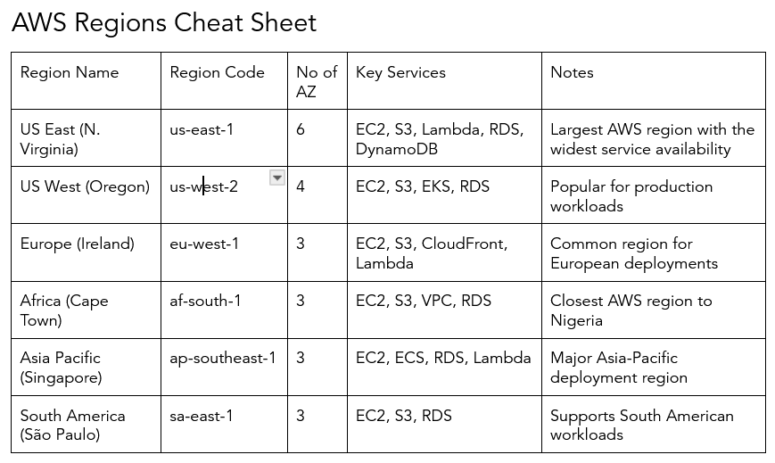
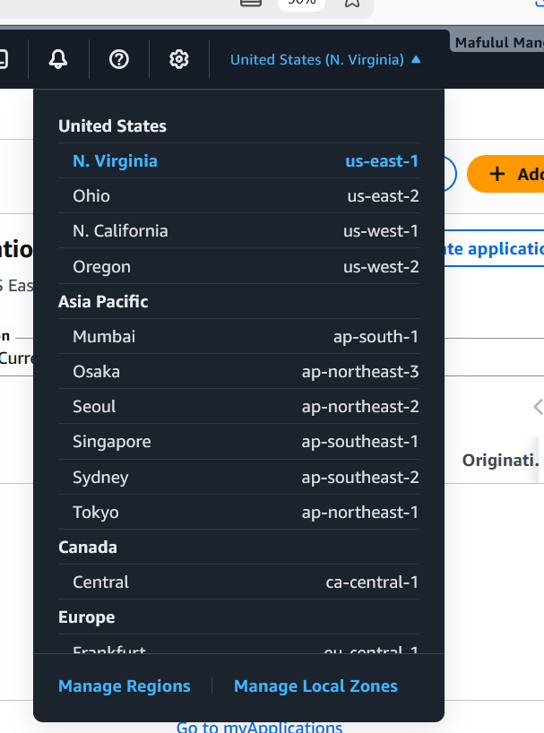
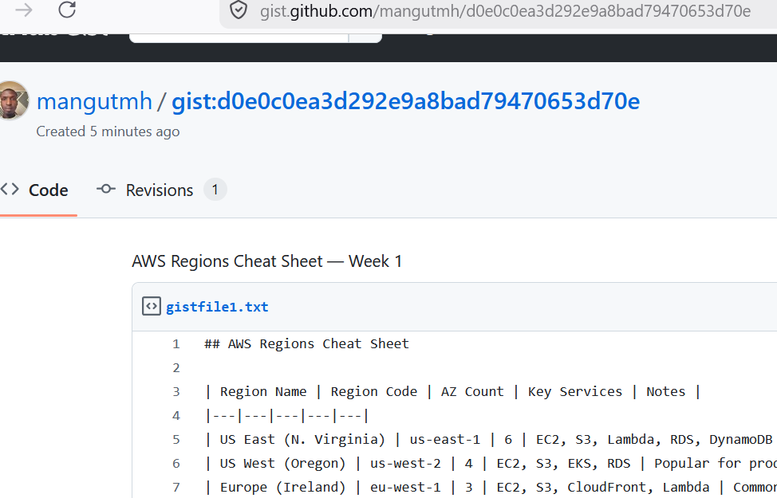

# Lab Name: Map AWS Regions & Build Your Infrastructure Cheat Sheet

## Overview
This lab explores AWS Global Infrastructure by using the interactive AWS map and AWS Console to identify regions, Availability Zones, and edge locations. The goal is to understand region selection, latency considerations for Nigeria, and build a personal AWS region reference cheat sheet for ongoing cloud learning and certification preparation.

## Learning Objectives
- Identify and analyze AWS Regions globally, with focus on Africa
- Understand Availability Zones (AZs) across key regions
- Compare service availability between regions (e.g., us-east-1 vs af-south-1)
- Determine nearest AWS edge locations for Nigeria
- Build a structured AWS Region reference cheat sheet

## AWS Services Used
- AWS Global Infrastructure (Regions & Availability Zones)
- AWS Management Console
- Amazon EC2 Dashboard
- AWS Region Selector

## Prerequisites
- AWS Free Tier account from Lab 1
- GitHub account (free at github.com) OR Notion account (notion.so)

## Step-by-Step Instructions

### Step 1: Explore the AWS Global Infrastructure Map
1. Visit https://infrastructure.aws — the interactive AWS global map. 
2. Identify all AWS Regions shown in Africa. Note: af-south-1 (Cape Town) is the primary option for West/Central African latency. 
3. Click on the US East (N. Virginia) region — note how many Availability Zones it has. 
4. Click on af-south-1 (Cape Town) — note its AZ count and available services. 
5. Find the nearest Edge Location to Nigeria — check for locations in Lagos or West Africa.

### Step 2: Use the Console to Verify Regions
1. Sign in to your AWS console. 
2. Click the Region selector (top-right) — count the total number of regions listed. 
3. Switch to af-south-1 (Cape Town). Note: some services may show as unavailable here. 
4. Switch back to us-east-1 (N. Virginia) — this is the region with the most available services. 
5. In the EC2 console, go to EC2 Dashboard. Note the Availability Zones listed for us-east-1. 

### Step 3: Build Your Region Cheat Sheet
1. Open a text editor, Notion, or Google Docs.
2. Create a table with columns: Region Name | Region Code | AZ Count | Key Services | Notes.
3. Fill in at least 6 rows including: us-east-1, us-west-2, eu-west-1, af-south-1, ap-southeast 1, sa-east-1.
4. Add a second section: 'Key Facts to Remember' with the 3 exam traps from your slides.
5. Add a third section: 'Nigeria Context' — latency to af-south-1, data sovereignty notes.
6. Save this as your permanent AWS reference document — you will add to it every week.

### Step 4: Publish to GitHub Gist 
1. Go to https://gist.github.com.
2. Paste your cheat sheet content. Title it 'AWS Regions Cheat Sheet — Week 1'.
3. Set visibility to Public. Click Create public gist.
4. Copy the URL — this is your first portfolio artifact link.

## Screenshots

## Key Concepts Learned
- AWS Regions are geographically isolated locations
- Each region contains multiple Availability Zones (AZs)
- us-east-1 typically has the widest service availability, af-south-1 is the closest major region for Nigeria, affecting latency
- Edge locations improve content delivery speed globally

## Challenges Faced & Solutions
| Challenge                              | Solution                                                   |
| -------------------------------------- | ---------------------------------------------------------- |
| Understanding region vs AZ difference  | Compared AWS documentation with console examples           |
| Identifying Africa region availability | Used AWS global infrastructure map for visual confirmation |

## Cleanup
No cloud resources were created in this lab, so no cleanup actions were required.

---
*Completed: April 2026 | BaseStack AWS Cloud Accelerator — Cohort 1*
